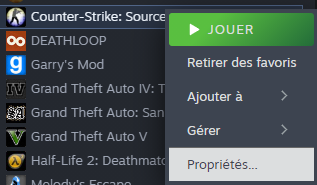

# How to join a bhop server

## -console

If you want to join a specific server, it's probably faster to take the server's ip and port and join the server with it.

To have your console launched each time you start the game, start by going to the **game properties**, then to **launch options**. Then write **-console.**

.png>)

## steam://connect/ip:port

If you have a server's ip and port, you can also connect to it this way.

Launch your Counter-Strike: Source, and go back to your desktop.

use the keyboard shortcut WIN + R.

.png>)It should open this little window.

Now you can write the following :&#x20;

#### **steam://connect/ip:port**

.png>)It should looks like this.

Now click OK and go back to your game. You are normally logging in

&#x20;

_This method also works with the google chrome's address bar._

## Once I am connected

You can go in your server history and connect again.

.png>)
